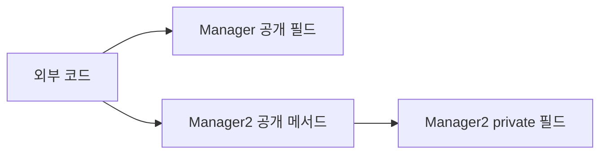
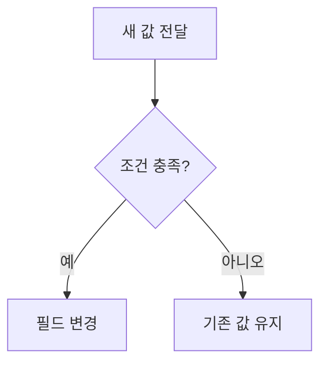

# Solution08로 이해하는 캡슐화

이 문서는 [`Solution08.java`](./Solution08.java)에 나온 내용만 간단히 정리한다.

## 1. 필드 공개와 `private`

`Manager`는 필드를 직접 공개하고, `Manager2`는 필드를 `private`으로 숨긴다.

| 클래스 | 필드 접근 | 결과 |
|---|---|---|
| `Manager` | 외부에서 직접 변경 가능 | 잘못된 값이나 배열 변경을 막기 어려움 |
| `Manager2` | 클래스 내부에서만 접근 가능 | 메서드를 통해 접근 규칙을 적용 가능 |



캡슐화는 필드를 감추는 것에서 끝나지 않고, 객체의 상태가 정해진 규칙을 지키도록 변경 경로를 관리하는 것이다.

## 2. setter를 통한 값 검증

| 메서드 | 허용 조건 | 조건 위반 시 |
|---|---|---|
| `setProductName()` | 이름 길이가 3 | 변경하지 않고 반환 |
| `setProductPrice()` | 1 이상 1000 이하 | 변경하지 않고 반환 |



코드에서 `setProductPrice(10000)`은 조건을 벗어나므로 기존 가격 `1000`이 유지된다. 다만 생성자와 `setArr()`에는 같은 검증이나 복사 규칙이 적용되지 않았다.

## 3. 동작으로 상태 변경

```java
public void incrementCount() {
    count++;
}

public void toggleFlag() {
    flag = !flag;
}
```

`count`와 `flag`를 외부에 공개하지 않고 의미가 드러나는 메서드로 변경한다. 이렇게 하면 호출자가 내부 변경 방식을 알 필요가 없다.

## 4. 배열과 방어적 복사

배열은 참조 타입이므로 원본 배열을 그대로 반환하면 외부에서 내부 상태를 변경할 수 있다.

```java
public int[] getArr() {
    return Arrays.copyOf(arr, arr.length);
}
```


`bananaManager2.getArr()[0] = 100`은 반환된 사본만 바꾸므로 내부 배열은 유지된다. 반면 `setArr(int[] arr)`는 전달받은 배열을 그대로 저장하므로 완전한 방어적 복사를 하려면 입력 배열도 복사해야 한다.

> 배열을 문자열과 연결해 출력하면 원소가 아니라 `[I@...` 형태의 타입·식별 정보가 보인다. 원소를 출력하려면 `Arrays.toString(array)`를 사용한다.

## 면접·실무 핵심 정리

| 질문 | 짧은 답변 |
|---|---|
| 캡슐화는 필드를 `private`으로 만드는 것뿐인가? | 아니다. 유효한 상태와 변경 규칙을 객체 내부에서 관리하는 것이다. |
| 모든 필드에 getter/setter를 만들면 좋은가? | 아니다. 필요한 조회와 의미 있는 상태 변경만 공개해야 한다. |
| 배열 getter에서 복사본을 반환하는 이유는? | 외부 코드가 내부 배열을 직접 변경하지 못하게 하기 위해서다. |
| 방어적 복사는 반환할 때만 필요한가? | 아니다. 변경 가능한 객체를 입력받아 저장할 때도 필요할 수 있다. |
